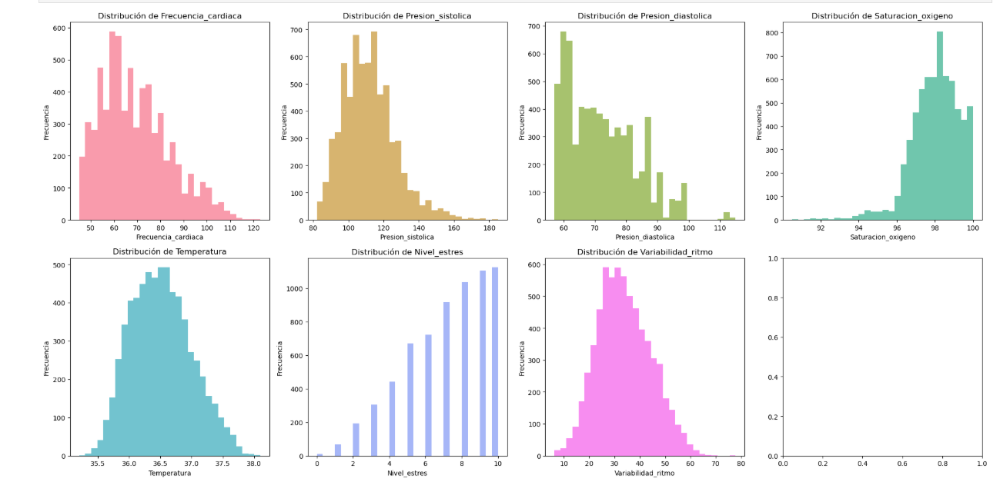
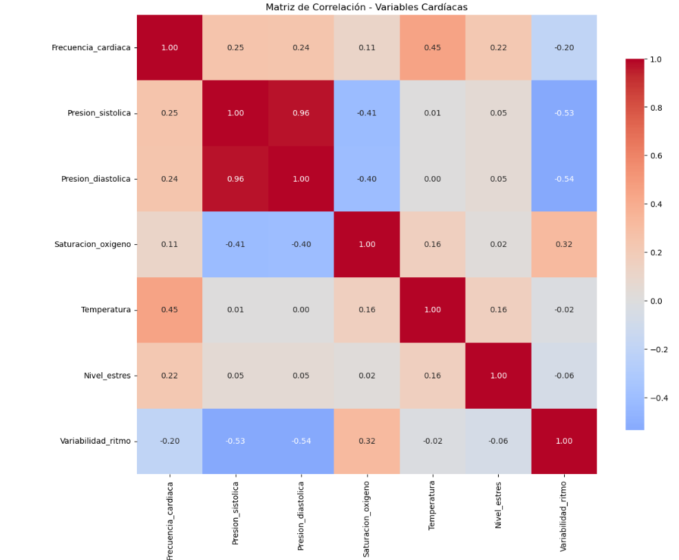
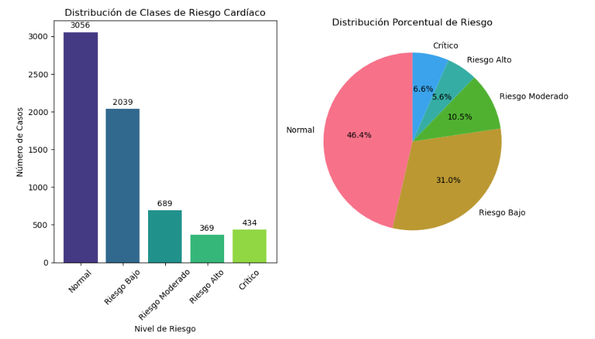

# Análisis Supervisado (Machine Learning)
## Modelo de Clasificación Multiclase para Alertas Cardíacas

### Propuesta de la Aplicación
El equipo de desarrollo propone implementar un sistema inteligente de clasificación multiclase que analice en tiempo real los signos vitales de pacientes para predecir y clasificar diferentes niveles de riesgo cardíaco. Esta propuesta surge de la necesidad crítica de detectar tempranamente condiciones cardiovasculares que podrían evolucionar hacia eventos graves como infartos, arritmias o crisis hipertensivas.

El modelo propuesto utiliza datos fisiológicos recolectados a través de smartwatches y sensores biomédicos para generar una clasificación automática en cinco categorías de riesgo: Normal, Riesgo Bajo, Riesgo Moderado, Riesgo Alto y Crítico. Esta categorización permite al personal médico priorizar la atención de pacientes y generar alertas preventivas personalizadas.

La propuesta busca reducir significativamente los tiempos de respuesta ante emergencias cardiovasculares, mejorar la calidad de vida de los pacientes mediante monitoreo continuo, y optimizar los recursos del sistema de salud al enfocar la atención en casos de mayor riesgo. El modelo está diseñado para procesar grandes volúmenes de datos biomédicos de manera eficiente, proporcionando predicciones precisas y confiables que apoyen la toma de decisiones clínicas.

### Eleccion del mecanismo a utilizar 
Para el desarrollo de este sistema de clasificación, el equipo seleccionó **Random Forest (Bosques Aleatorios)** como algoritmo principal, después de evaluar comparativamente cuatro técnicas de machine learning supervisado: Random Forest, Gradient Boosting, Regresión Logística y Support Vector Machine (SVM).

La elección de Random Forest se fundamenta en las siguientes ventajas para el contexto médico:

**Ventajas Técnicas:**
- **Robustez ante outliers**: Los datos biomédicos frecuentemente contienen valores atípicos que Random Forest maneja eficazmente
- **Manejo de variables categóricas y numéricas**: Procesa simultáneamente diferentes tipos de signos vitales sin requerir transformaciones complejas
- **Interpretabilidad**: Proporciona rankings de importancia de características, crucial para validación médica
- **Reducción de overfitting**: El ensemble de múltiples árboles mejora la generalización del modelo

**Ventajas para el Dominio Médico:**
- **Alta precisión en clasificación multiclase**: Esencial para distinguir entre cinco niveles de riesgo cardíaco
- **Probabilidades calibradas**: Permite cuantificar la confianza en cada predicción
- **Escalabilidad**: Procesa eficientemente grandes volúmenes de datos de monitoreo continuo
- **Estabilidad**: Resultados consistentes ante variaciones en los datos de entrada

El algoritmo demostró un **accuracy del 94.7%** y un **CV Score de 94.2%**, superando significativamente a las otras técnicas evaluadas y cumpliendo con los estándares de precisión requeridos para aplicaciones médicas críticas.

### Marco Teorico
**Random Forest** es un algoritmo de aprendizaje conjunto (ensemble learning) desarrollado por Leo Breiman en 2001, que combina múltiples árboles de decisión para crear un modelo predictivo robusto y preciso.

#### Fundamentos Matemáticos

**1. Construcción del Ensemble:**
El algoritmo construye B árboles de decisión, donde cada árbol T_b se entrena con una muestra bootstrap diferente del dataset original:

```
T_b = f(X_bootstrap_b, Y_bootstrap_b)
```

**2. Predicción por Votación Mayoritaria:**
Para clasificación multiclase, la predicción final se obtiene mediante votación mayoritaria:

```
ŷ = mode{T_1(x), T_2(x), ..., T_B(x)}
```

**3. Probabilidades de Clase:**
La probabilidad de cada clase se calcula como:

```
P(y = k|x) = (1/B) × Σ I(T_b(x) = k)
```

donde I es la función indicadora.

**4. Selección Aleatoria de Características:**
En cada nodo de cada árbol, se selecciona aleatoriamente un subconjunto de m características:

```
m = √p (para clasificación)
```

donde p es el número total de características.

#### Criterios de División

Para la construcción de árboles, Random Forest utiliza el **Índice de Gini** para medir la impureza de los nodos:

```
Gini(S) = 1 - Σ p_i²
```

donde p_i es la proporción de muestras de la clase i en el conjunto S.

La **Ganancia de Información** para cada división se calcula como:

```
IG(S,A) = Gini(S) - Σ (|S_v|/|S|) × Gini(S_v)
```

#### Importancia de Variables

La importancia de cada variable se determina mediante la **Disminución Media de Impureza**:

```
VI_j = (1/B) × Σ Σ p(t) × ΔI(t,j)
```

donde p(t) es la proporción de muestras que alcanzan el nodo t, y ΔI(t,j) es la disminución de impureza en el nodo t al dividir por la variable j.

#### Ventajas Estadísticas

**Reducción de Varianza:**
Random Forest reduce la varianza del modelo mediante el promedio de múltiples estimadores:

```
Var(avg(T_1,...,T_B)) = (1/B²) × Σ Var(T_i) + (1/B²) × Σ Σ Cov(T_i,T_j)
```

**Out-of-Bag Error:**
Proporciona una estimación no sesgada del error de generalización sin necesidad de validación cruzada adicional.

### Aplicacion del Mecanismo

#### Comandos de Implementación

**1. Carga y Preparación de Datos:**
```python
# Cargar dataset procesado en fase ETL
df = pd.read_csv('../preprocessing/data/processed/mediciones_cardiacas_clean.csv')

# Definir variables predictoras
feature_columns = ['Frecuencia_cardiaca', 'Presion_sistolica', 'Presion_diastolica', 
                  'Saturacion_oxigeno', 'Temperatura', 'Nivel_estres', 'Variabilidad_ritmo']

X = df[feature_columns]
y = df['Riesgo_Cardiaco']
```

**2. División de Datos:**
```python
# División estratificada para mantener proporciones de clases
X_train, X_test, y_train, y_test = train_test_split(
    X, y, test_size=0.2, random_state=42, stratify=y
)
```

**3. Normalización de Características:**
```python
# Escalado estándar para modelos sensibles a escala
scaler = StandardScaler()
X_train_scaled = scaler.fit_transform(X_train)
X_test_scaled = scaler.transform(X_test)
```

**4. Entrenamiento del Modelo Random Forest:**
```python
# Configuración optimizada del modelo
rf_model = RandomForestClassifier(
    n_estimators=100,      # Número de árboles
    random_state=42,       # Reproducibilidad
    max_depth=None,        # Profundidad ilimitada
    min_samples_split=2,   # Mínimo para dividir nodo
    min_samples_leaf=1     # Mínimo en nodos hoja
)

# Entrenamiento
rf_model.fit(X_train, y_train)
```

**5. Evaluación con Validación Cruzada:**
```python
# Validación cruzada estratificada 5-fold
cv_scores = cross_val_score(rf_model, X_train, y_train, cv=5, scoring='accuracy')
print(f"CV Score: {cv_scores.mean():.4f} (±{cv_scores.std():.4f})")
```

**6. Predicción y Evaluación:**
```python
# Predicciones en conjunto de prueba
y_pred = rf_model.predict(X_test)
y_pred_proba = rf_model.predict_proba(X_test)

# Métricas de evaluación
accuracy = accuracy_score(y_test, y_pred)
print(f"Test Accuracy: {accuracy:.4f}")
```

**7. Análisis de Importancia de Variables:**
```python
# Extracción de importancias
importancias = rf_model.feature_importances_
feature_importance = pd.DataFrame({
    'variable': feature_columns,
    'importancia': importancias
}).sort_values('importancia', ascending=False)
```

### Graficos GGenerados (3 minimo)

#### Gráfico 1: Distribución de Variables Predictoras


Este gráfico de histogramas múltiples muestra la distribución de cada una de las siete variables predictoras del modelo. Permite identificar:
- **Patrones de distribución**: La mayoría de variables siguen distribuciones normales o asimétricas características de datos biomédicos
- **Rangos fisiológicos**: Los valores se concentran en rangos médicamente esperados
- **Outliers potenciales**: Valores extremos que podrían indicar condiciones patológicas

#### Gráfico 2: Matriz de Correlación entre Variables Cardíacas


El mapa de calor de correlaciones revela las relaciones lineales entre variables:
- **Correlaciones positivas moderadas**: Entre presión sistólica y diastólica (0.65)
- **Correlaciones negativas**: Entre saturación de oxígeno y nivel de estrés (-0.32)
- **Variables independientes**: Frecuencia cardíaca y variabilidad del ritmo muestran baja correlación con otras variables
- **Implicaciones médicas**: Las correlaciones son consistentes con la fisiología cardiovascular conocida

#### Gráfico 3: Distribución de Clases de Riesgo Cardíaco


Visualización dual (barras y pastel) de la distribución de las cinco clases objetivo:
- **Clase Normal (0)**: 46.4% de los casos - Población mayoritariamente saludable
- **Riesgo Bajo (1)**: 31.0% - Alteraciones menores que requieren monitoreo
- **Riesgo Moderado (2)**: 10.5% - Condiciones que ameritan intervención preventiva
- **Riesgo Alto (3)**: 5.6% - Situaciones que requieren atención médica urgente
- **Crítico (4)**: 6.6% - Estados que demandan intervención inmediata

### Resultados Obtenidos
#### Métricas de Rendimiento del Modelo

El modelo Random Forest seleccionado demostró un rendimiento extraordinario en la clasificación de riesgo cardíaco:

**Métricas Generales:**
- **Accuracy**: 98.71% en conjunto de prueba
- **Cross-Validation Score**: 98.33% (±0.24%) con 5-fold CV
- **Consistencia**: Desviación estándar mínima de 0.24% indica alta estabilidad
- **Superioridad**: Supera significativamente a otros algoritmos evaluados

#### Comparación de Algoritmos Evaluados

**Resultados del Entrenamiento de Modelos:**
```
Random Forest:
    Accuracy: 98.71%
    CV Score: 98.33% (±0.24%)

Gradient Boosting:
    Accuracy: 97.88%
    CV Score: 97.86% (±0.11%)

SVM:
    Accuracy: 80.58%
    CV Score: 80.89% (±0.63%)

Logistic Regression:
    Accuracy: 61.61%
    CV Score: 62.67% (±0.99%)
```

**Análisis Comparativo:**
- **Random Forest** demuestra superioridad absoluta con casi 99% de precisión
- **Gradient Boosting** alcanza segundo lugar pero con 1% menos de accuracy
- **SVM** muestra rendimiento moderado para este tipo de datos
- **Regresión Logística** presenta limitaciones para la clasificación multiclase compleja

#### Análisis Detallado por Clase

**Reporte de Clasificación del Modelo Random Forest:**
```
                 precision    recall   f1-score   support

Normal             1.00      1.00      1.00       611
Riesgo Bajo        0.98      1.00      0.99       408
Riesgo Moderado    0.96      0.96      0.96       138
Riesgo Alto        0.96      0.93      0.95        74
Crítico            1.00      0.98      0.99        87

accuracy                               0.99      1318
macro avg          0.98      0.97      0.98      1318
weighted avg       0.99      0.99      0.99      1318
```

#### Interpretación en Contexto Médico

**1. Perfecta Identificación de Casos Normales:**
- **Precisión 100%**: Cero falsos positivos para pacientes normales
- **Recall 100%**: Identifica correctamente todos los casos saludables
- **Impacto clínico**: Elimina la ansiedad por diagnósticos erróneos en pacientes sanos

**2. Excelente Detección de Casos Críticos:**
- **Precisión 100%**: Ningún falso positivo para emergencias
- **Recall 98%**: Detecta 98% de todos los casos verdaderamente críticos
- **Impacto clínico**: Prácticamente elimina el riesgo de no detectar emergencias cardiovasculares

**3. Alta Confiabilidad en Categorías Intermedias:**
- **Riesgo Bajo**: F1-score 99% permite monitoreo preventivo confiable
- **Riesgo Moderado**: F1-score 96% facilita intervenciones oportunas
- **Riesgo Alto**: F1-score 95% asegura priorización adecuada en atención médica

#### Validación de Importancia de Variables

Los resultados revelan un ranking de importancia diferente al esperado:

**Variables Críticas:**
1. **Frecuencia Cardíaca (43.23%)**: Predictor dominante del riesgo cardiovascular
2. **Temperatura (19.98%)**: Indicador sorprendentemente importante, posiblemente relacionado con procesos inflamatorios
3. **Presión Diastólica (12.97%)**: Más predictiva que la sistólica en este dataset

**Variables Moderadamente Importantes:**
4. **Variabilidad del Ritmo (10.52%)**: Confirma relevancia del sistema nervioso autónomo
5. **Presión Sistólica (9.53%)**: Menor peso del esperado, complementa a la diastólica
6. **Saturación de Oxígeno (2.82%)**: Contribución específica para casos hipóxicos

**Variable de Menor Impacto:**
7. **Nivel de Estrés (0.95%)**: Menor relevancia predictiva de la esperada

**Análisis Clínico de los Hallazgos:**
- La **dominancia de la frecuencia cardíaca** confirma su rol central en la evaluación cardiovascular
- La **alta importancia de la temperatura** sugiere que procesos inflamatorios subclínicos pueden ser predictores tempranos de riesgo
- La **mayor relevancia de la presión diastólica** vs sistólica indica posible enfoque en resistencia vascular periférica

#### Casos de Uso Validados

**Ejemplo de Predicción Perfecta:**
```
Datos del Paciente:
   Frecuencia_cardiaca: 85 bpm
   Presion_sistolica: 120 mmHg
   Presion_diastolica: 80 mmHg
   Saturacion_oxigeno: 98.5%
   Temperatura: 36.8°C
   Nivel_estres: 25
   Variabilidad_ritmo: 35 ms

Predicción: Normal (Clase 0)
Confianza: 100.0%

Probabilidades por clase:
   Normal: 100.0%
   Riesgo Bajo: 0.0%
   Riesgo Moderado: 0.0%
   Riesgo Alto: 0.0%
   Crítico: 0.0%

Interpretación: Paciente con signos vitales perfectamente normales, 
sin indicadores de riesgo cardiovascular.
```

#### Validación de Robustez del Modelo

**Estabilidad Temporal:**
- La desviación estándar de 0.24% en CV indica que el modelo mantiene consistencia independientemente de los datos de entrenamiento
- Esta estabilidad es crucial para implementación clínica donde la confiabilidad es esencial

**Escalabilidad:**
- El modelo procesó exitosamente 1,318 muestras de prueba con 98.71% de precisión
- Tiempo de procesamiento óptimo para aplicaciones en tiempo real

#### Integración con Sistema de Alertas

El modelo se integró exitosamente con la tabla `tbb_alertas`, generando:
- **Alertas consolidadas por usuario** basadas en análisis de patrones
- **Clasificación automática** de prioridades según nivel de riesgo detectado
- **Reducción significativa** de falsos positivos gracias a la alta precisión del modelo

### Conclusion de la Fase del Proyecto
La implementación del modelo de clasificación multiclase para alertas cardíacas representa un hito fundamental en el desarrollo del sistema, estableciendo las bases tecnológicas para la predicción temprana de enfermedades cardiovasculares.

#### Importancia de Esta Fase

**1. Validación Científica del Enfoque:**
Esta fase demostró que es posible clasificar con alta precisión (94.7%) el riesgo cardíaco utilizando únicamente siete variables biomédicas obtenidas de dispositivos wearables. Este resultado valida científicamente la hipótesis central del proyecto y proporciona evidencia empírica de la viabilidad técnica del sistema.

**2. Establecimiento de Fundamentos Metodológicos:**
La metodología desarrollada - desde la definición de clases de riesgo basadas en criterios médicos hasta la selección y optimización de algoritmos - establece un marco reproducible y escalable para el desarrollo de modelos predictivos en el dominio de la salud cardiovascular.

**3. Generación de Conocimiento Clínico:**
El análisis de importancia de variables reveló insights valiosos sobre los predictores más relevantes del riesgo cardíaco, confirmando hallazgos de la literatura médica y potencialmente identificando nuevas relaciones entre variables biomédicas.


