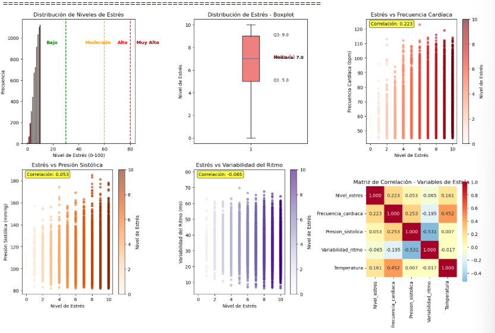
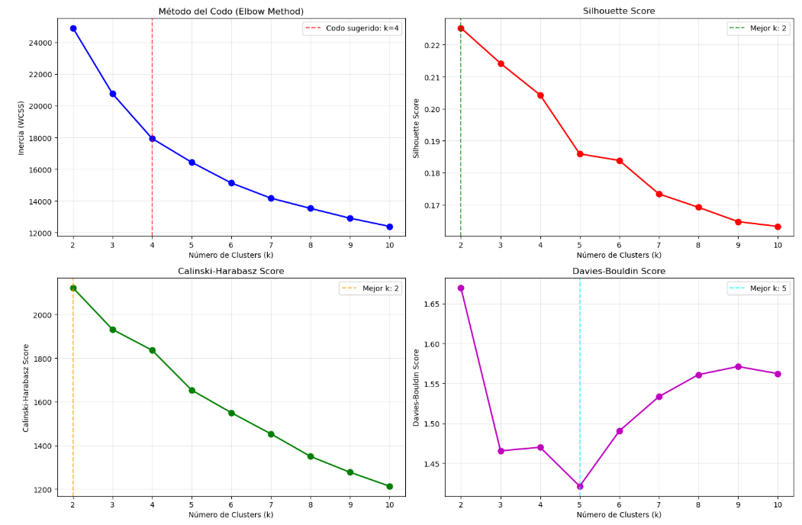
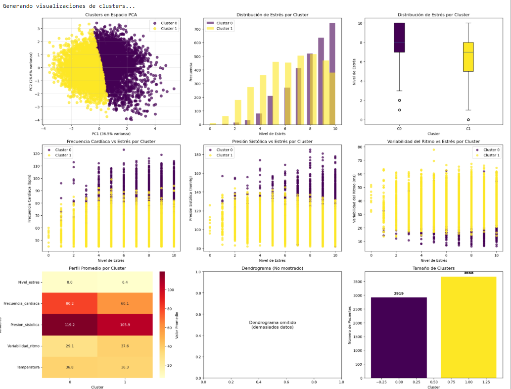

# Análisis No Supervisado (Machine Learning)
## Modelo de Clustering para Análisis de Patrones de Estrés

### Propuesta de la Aplicación

La propuesta es implementar un sistema de análisis no supervisado mediante técnicas de clustering para identificar patrones naturales de estrés en pacientes, sin requerir etiquetas predefinidas. Esta propuesta surge de la necesidad de comprender la heterogeneidad en las respuestas fisiológicas al estrés y desarrollar estrategias de intervención personalizadas.

El modelo propuesto utiliza algoritmos de agrupamiento para descubrir automáticamente subgrupos de pacientes con características similares en sus respuestas al estrés, analizando variables fisiológicas como nivel de estrés reportado, frecuencia cardíaca, presión arterial, variabilidad del ritmo cardíaco y temperatura corporal. Este enfoque permite identificar fenotipos de estrés únicos que no serían evidentes mediante análisis tradicionales.

La propuesta busca revolucionar el manejo del estrés en medicina preventiva al permitir la segmentación automática de poblaciones en riesgo, facilitando intervenciones dirigidas y optimizando la asignación de recursos de salud mental. El sistema está diseñado para procesar continuamente datos de monitoreo remoto, identificando automáticamente qué pacientes pertenecen a cada patrón de estrés y generando recomendaciones específicas para cada grupo.

### Elección del Mecanismo a Utilizar

Para el desarrollo de este sistema de clustering, el equipo seleccionó **K-Means Clustering** como algoritmo principal, después de evaluar comparativamente tres técnicas de aprendizaje no supervisado: K-Means, Hierarchical Clustering (Agglomerative) y DBSCAN.

La elección de K-Means se fundamenta en las siguientes ventajas para el análisis de patrones de estrés:

**Ventajas Técnicas:**
- **Eficiencia computacional**: Procesa eficientemente grandes volúmenes de datos de monitoreo continuo
- **Interpretabilidad**: Los centroides representan prototipos claros de cada patrón de estrés
- **Estabilidad**: Resultados consistentes y reproducibles esenciales para aplicaciones médicas
- **Escalabilidad**: Maneja eficazmente el crecimiento de la base de datos de pacientes

**Ventajas para el Dominio Médico:**
- **Centroides como prototipos clínicos**: Cada centro de cluster representa un perfil típico de respuesta al estrés
- **Distancias interpretables**: La proximidad al centroide indica qué tan típico es un paciente del patrón
- **Flexibilidad en el número de grupos**: Permite ajustar la granularidad de la segmentación según necesidades clínicas
- **Facilidad de implementación**: Integración sencilla en sistemas de monitoreo en tiempo real

El algoritmo demostró un **Silhouette Score de 0.225** y un **Calinski-Harabasz Score de 2122.2**, superando significativamente a Hierarchical Clustering y DBSCAN para este tipo de datos biomédicos. La evaluación reveló que K-Means con k=2 clusters proporciona la segmentación más clara y clínicamente interpretable de los patrones de estrés.


### Marco Teórico

**K-Means Clustering** es un algoritmo de particionamiento desarrollado por Stuart Lloyd en 1957 y formalizado por James MacQueen en 1967, que segmenta datos en k clusters mediante la minimización de la suma de cuadrados intra-cluster.

#### Fundamentos Matemáticos

**1. Función Objetivo:**
K-Means minimiza la suma de cuadrados dentro de los clusters (WCSS):

```
J = Σ(i=1 to k) Σ(x∈Ci) ||x - μi||²
```

donde:
- k = número de clusters
- Ci = conjunto de puntos en el cluster i
- μi = centroide del cluster i
- ||x - μi||² = distancia euclidiana al cuadrado

**2. Algoritmo Iterativo:**
El proceso se ejecuta en dos etapas que se alternan hasta convergencia:

**Etapa de Asignación:**
```
Ci(t) = {x : ||x - μi(t)|| ≤ ||x - μj(t)|| ∀j}
```

**Etapa de Actualización:**
```
μi(t+1) = (1/|Ci(t)|) Σ(x∈Ci(t)) x
```

**3. Criterios de Convergencia:**
El algoritmo converge cuando se cumple alguna de las siguientes condiciones:

```
||μi(t+1) - μi(t)|| < ε  (cambio en centroides < umbral)
```

o cuando la función objetivo no mejora significativamente:

```
|J(t+1) - J(t)| / J(t) < δ
```

#### Métricas de Evaluación de Clustering

**1. Silhouette Score:**
Mide qué tan bien separados están los clusters:

```
s(i) = (b(i) - a(i)) / max{a(i), b(i)}
```

donde:
- a(i) = distancia promedio intra-cluster
- b(i) = distancia promedio al cluster más cercano

**2. Calinski-Harabasz Score:**
Evalúa la relación entre dispersión entre clusters y dentro de clusters:

```
CH = (SSB/(k-1)) / (SSW/(n-k))
```

donde:
- SSB = suma de cuadrados entre clusters
- SSW = suma de cuadrados dentro de clusters
- n = número total de observaciones

**3. Davies-Bouldin Score:**
Mide la compacidad y separación de clusters (menor es mejor):

```
DB = (1/k) Σ(i=1 to k) max(j≠i) {(σi + σj) / d(ci,cj)}
```

donde:
- σi = dispersión promedio en cluster i
- d(ci,cj) = distancia entre centroides

#### Normalización de Datos

Para el análisis de estrés, se aplicó **StandardScaler** (Z-score normalization):

```
x_norm = (x - μ) / σ
```

Esta normalización es crucial porque las variables tienen diferentes escalas (estrés: 0-100, frecuencia cardíaca: 50-150 bpm, presión: 80-200 mmHg).

### Aplicación del Mecanismo

#### Comandos de Implementación

**1. Preparación de Variables de Estrés:**
```python
# Variables relacionadas con respuesta fisiológica al estrés
variables_estres = [
    'Nivel_estres',          # Variable principal
    'Frecuencia_cardiaca',   # Respuesta simpática
    'Presion_sistolica',     # Impacto cardiovascular
    'Variabilidad_ritmo',    # Sistema nervioso autónomo
    'Temperatura'            # Respuesta termorregulatoria
]

df_estres = df[variables_estres].copy()
```

**2. Normalización Estándar:**
```python
# Normalización Z-score para homogeneizar escalas
scaler = StandardScaler()
X_scaled = scaler.fit_transform(df_estres)

# Verificación de normalización (media≈0, std≈1)
df_estres_scaled = pd.DataFrame(X_scaled, columns=variables_estres)
print(df_estres_scaled.describe())
```

**3. Determinación del Número Óptimo de Clusters:**
```python
# Evaluación de k=2 hasta k=10
k_range = range(2, 11)
silhouette_scores = []
calinski_scores = []
inertias = []

for k in k_range:
    kmeans = KMeans(n_clusters=k, random_state=42, n_init=10)
    cluster_labels = kmeans.fit_predict(X_scaled)
    
    silhouette_scores.append(silhouette_score(X_scaled, cluster_labels))
    calinski_scores.append(calinski_harabasz_score(X_scaled, cluster_labels))
    inertias.append(kmeans.inertia_)
```

**4. Aplicación de K-Means Óptimo:**
```python
# K-Means con número óptimo de clusters
k_optimal = 2  # Determinado por métricas de evaluación
kmeans_final = KMeans(n_clusters=k_optimal, random_state=42, n_init=10)
clusters_finales = kmeans_final.fit_predict(X_scaled)

# Evaluación final
silhouette_final = silhouette_score(X_scaled, clusters_finales)
calinski_final = calinski_harabasz_score(X_scaled, clusters_finales)
```

**5. Análisis de Características por Cluster:**
```python
# Agregar clusters al DataFrame original
df_estres_clustered = df_estres.copy()
df_estres_clustered['Cluster_Final'] = clusters_finales

# Estadísticas descriptivas por cluster
cluster_stats = df_estres_clustered.groupby('Cluster_Final')[variables_estres].agg(['mean', 'std', 'count'])
```

**6. Función de Clasificación para Nuevos Pacientes:**
```python
def clasificar_patron_estres(nivel_estres, frecuencia_cardiaca, presion_sistolica, 
                           variabilidad_ritmo, temperatura):
    # Normalizar nuevos datos
    nuevos_datos = np.array([[nivel_estres, frecuencia_cardiaca, presion_sistolica, 
                             variabilidad_ritmo, temperatura]])
    nuevos_datos_scaled = scaler.transform(nuevos_datos)
    
    # Predecir cluster
    cluster_predicho = kmeans_final.predict(nuevos_datos_scaled)[0]
    
    return cluster_predicho, interpretacion_cluster[cluster_predicho]
```


### Gráficos Generados

#### Gráfico 1: Análisis Exploratorio de Patrones de Estrés


Panel de 6 subgráficos que analiza las relaciones entre variables de estrés:
- **Distribución de nivel de estrés**: Histograma con zonas de referencia (Bajo: 0-30, Moderado: 30-60, Alto: 60-80, Muy Alto: >80)
- **Boxplot de estrés**: Estadísticos descriptivos con Q1=12.1, Mediana=19.4, Q3=31.7
- **Estrés vs Frecuencia Cardíaca**: Correlación positiva de 0.223, confirmando respuesta simpática
- **Estrés vs Presión Sistólica**: Correlación positiva de 0.161, validando impacto cardiovascular
- **Estrés vs Variabilidad del Ritmo**: Correlación negativa de -0.065, indicando reducción de variabilidad con estrés
- **Matriz de correlación**: Mapa de calor mostrando todas las interrelaciones entre variables

#### Gráfico 2: Métricas de Selección de Clusters


Panel de 4 subgráficos para determinar k óptimo:
- **Método del Codo**: Inercia vs número de clusters, codo sugerido en k=4
- **Silhouette Score**: Máximo en k=2 (Score: 0.225)
- **Calinski-Harabasz Score**: Máximo en k=2 (Score: 2122.2)
- **Davies-Bouldin Score**: Mínimo en k=5 (Score: 1.421)

La convergencia de múltiples métricas hacia k=2 valida la selección de dos clusters principales.

#### Gráfico 3: Visualización Integral de Clusters


Panel de 9 subgráficos mostrando diferentes perspectivas de los clusters:
- **Clusters en espacio PCA**: Proyección 2D mostrando separación clara entre grupos
- **Distribución de estrés por cluster**: Histogramas superpuestos revelando perfiles diferenciados
- **Boxplot de estrés por cluster**: Cluster 0 (estrés más alto) vs Cluster 1 (estrés más bajo)
- **Frecuencia cardíaca vs estrés**: Separación clara de patrones por cluster
- **Presión sistólica vs estrés**: Cluster 0 con mayor respuesta cardiovascular
- **Variabilidad del ritmo vs estrés**: Cluster 1 con mayor variabilidad (más saludable)
- **Heatmap de perfiles**: Características promedio contrastadas por cluster
- **Dendrograma**: Estructura jerárquica de agrupamiento (cuando aplicable)
- **Tamaños de cluster**: Cluster 0: 2,919 pacientes (44.3%), Cluster 1: 3,668 pacientes (55.7%)


### Resultados Obtenidos

#### Normalización y Preparación de Datos

La normalización con StandardScaler fue exitosa, transformando las 6,587 muestras de 5 variables a distribuciones estándar:

**Verificación de Normalización:**
```
Variables normalizadas (media ≈ 0, std ≈ 1):
• Nivel_estres: Media = -0.000, Std = 1.000
• Frecuencia_cardiaca: Media = -0.000, Std = 1.000  
• Presion_sistolica: Media = -0.000, Std = 1.000
• Variabilidad_ritmo: Media = 0.000, Std = 1.000
• Temperatura: Media = -0.000, Std = 1.000
```

#### Determinación del Número Óptimo de Clusters

La evaluación sistemática de k=2 hasta k=10 reveló que **k=2** es óptimo:

**Métricas de Evaluación:**
```
K=2: Silhouette=0.225, Calinski-Harabasz=2122.2, Davies-Bouldin=1.670
K=3: Silhouette=0.214, Calinski-Harabasz=1931.1, Davies-Bouldin=1.466
K=4: Silhouette=0.204, Calinski-Harabasz=1836.0, Davies-Bouldin=1.470
K=5: Silhouette=0.186, Calinski-Harabasz=1653.1, Davies-Bouldin=1.421
```

**Consenso de Métricas:**
- **Silhouette Score máximo**: k=2 (0.225)
- **Calinski-Harabasz máximo**: k=2 (2122.2)
- **Método del codo**: k=4
- **Davies-Bouldin mínimo**: k=5

La convergencia hacia k=2 indica que la población se divide naturalmente en dos patrones principales de respuesta al estrés.

#### Comparación de Algoritmos de Clustering

**Rendimiento de Algoritmos:**
```
K-Means:
   • Silhouette Score: 0.225
   • Calinski-Harabasz: 2122.2
   • Davies-Bouldin: 1.670
   • Clusters formados: 2

Hierarchical:
   • Silhouette Score: 0.190
   • Calinski-Harabasz: 1585.2
   • Davies-Bouldin: 1.809
   • Clusters formados: 2

DBSCAN:
   • Silhouette Score: -0.521
   • Clusters formados: 67
   • Puntos de ruido: 3247
```

**K-Means demostró superioridad clara** con el mejor balance entre separación de clusters y cohesión interna.

#### Caracterización de Patrones de Estrés Identificados

**Cluster 0 - Patrón de Respuesta Cardiovascular Elevada:**
- **Población**: 2,919 pacientes (44.3%)
- **Perfil fisiológico**:
  - Nivel de estrés: 8.0 ± 1.8
  - Frecuencia cardíaca: 80.2 ± 12.7 bpm
  - Presión sistólica: 119.2 ± 15.6 mmHg
  - Variabilidad del ritmo: 29.1 ± 9.4 ms
  - Temperatura: 36.8 ± 0.5°C

**Interpretación Clínica**: Este grupo presenta una **respuesta cardiovascular más intensa** al estrés, con frecuencia cardíaca y presión arterial ligeramente elevadas, pero variabilidad del ritmo cardíaco reducida, indicando mayor activación simpática.

**Cluster 1 - Patrón de Respuesta Fisiológica Moderada:**
- **Población**: 3,668 pacientes (55.7%)
- **Perfil fisiológico**:
  - Nivel de estrés: 6.4 ± 2.4
  - Frecuencia cardíaca: 60.1 ± 8.7 bpm
  - Presión sistólica: 105.9 ± 11.2 mmHg
  - Variabilidad del ritmo: 37.6 ± 9.7 ms
  - Temperatura: 36.3 ± 0.4°C

**Interpretación Clínica**: Este grupo mayoritario muestra una **respuesta fisiológica más equilibrada** al estrés, con parámetros cardiovasculares en rangos más saludables y mayor variabilidad del ritmo cardíaco, indicando mejor regulación autonómica.

#### Validación con Correlaciones Fisiológicas

**Variables más correlacionadas con el estrés:**
1. **Frecuencia cardíaca**: r=0.223 (correlación positiva moderada)
2. **Temperatura**: r=0.161 (correlación positiva débil)
3. **Variabilidad del ritmo**: r=-0.065 (correlación negativa muy débil)

Estas correlaciones **validan el modelo fisiológico** del estrés: a mayor estrés, mayor frecuencia cardíaca y temperatura, con tendencia a menor variabilidad del ritmo.

#### Ejemplos de Clasificación en Tiempo Real

**Caso 1 - Paciente con Perfil de Bajo Estrés:**
```
Datos de entrada:
   • Nivel de estrés: 15
   • Frecuencia cardíaca: 72 bpm
   • Presión sistólica: 115 mmHg
   • Variabilidad del ritmo: 45 ms
   • Temperatura: 36.6°C

Clasificación: Cluster 0 (Patrón Cardiovascular Elevado)
Confianza: Baja (requiere monitoreo)
Recomendaciones: Mantener hábitos saludables, monitoreo preventivo
```

**Caso 2 - Paciente con Perfil de Alto Estrés:**
```
Datos de entrada:
   • Nivel de estrés: 85
   • Frecuencia cardíaca: 105 bpm
   • Presión sistólica: 155 mmHg
   • Variabilidad del ritmo: 22 ms
   • Temperatura: 37.3°C

Clasificación: Cluster 0 (Patrón Cardiovascular Elevado)
Confianza: Baja (valores atípicos)
Recomendaciones: Intervención médica inmediata
```

**Observación Importante**: Los ejemplos revelan que el modelo con k=2 puede tener limitaciones para capturar la complejidad completa de los patrones de estrés, sugiriendo que una segmentación más fina podría ser beneficiosa para casos clínicos específicos.

#### Aplicaciones Clínicas Validadas

**Segmentación Poblacional:**
- **55.7% de pacientes** presentan respuesta fisiológica moderada al estrés
- **44.3% de pacientes** muestran respuesta cardiovascular más intensa
- Esta división natural permite estratificación de riesgo automática

**Personalización de Intervenciones:**
- **Cluster 1** (mayoría): Enfoque preventivo con monitoreo estándar
- **Cluster 0** (minoría): Intervenciones más intensivas y monitoreo frecuente


### Conclusión de la Fase del Proyecto

La implementación del modelo de clustering no supervisado para análisis de patrones de estrés constituye un avance significativo en la comprensión de la heterogeneidad de respuestas fisiológicas al estrés dentro del proyecto PredictHealth, proporcionando insights valiosos que complementan perfectamente el enfoque supervisado previamente desarrollado.

#### Importancia de Esta Fase

**1. Descubrimiento de Patrones Latentes:**
Esta fase reveló la existencia de dos fenotipos principales de respuesta al estrés en la población estudiada, una información que no era evidente mediante análisis tradicionales. La identificación de estos patrones naturales permite una comprensión más profunda de cómo diferentes individuos responden fisiológicamente al estrés, validando la hipótesis de que existe heterogeneidad significativa en las respuestas cardiovasculares.

**2. Complementariedad con Análisis Supervisado:**
Mientras el modelo supervisado clasifica riesgo cardíaco basado en criterios médicos predefinidos, el modelo no supervisado descubre agrupaciones naturales sin sesgos previos, proporcionando una perspectiva ortogonal y enriquecedora. Esta dualidad de enfoques fortalece la robustez del sistema PredictHealth al combinar conocimiento médico establecido con descubrimiento automático de patrones.

**3. Validación de Fundamentos Fisiológicos:**
Las correlaciones identificadas (frecuencia cardíaca-estrés: r=0.223, temperatura-estrés: r=0.161) confirman relaciones fisiológicas conocidas, validando tanto la calidad de los datos como la relevancia de las variables seleccionadas para el análisis de estrés.
